# vendaschilantecontainer Design System

You are building UI for **vendaschilantecontainer**. Dark-themed, cool palette, sans-serif typography (Track), standard density on a 5px grid, expressive motion.

## Visual Reference

**IMPORTANT**: Study ALL screenshots below before writing any UI. Match colors, typography, spacing, layout, and motion exactly as shown.

### Homepage

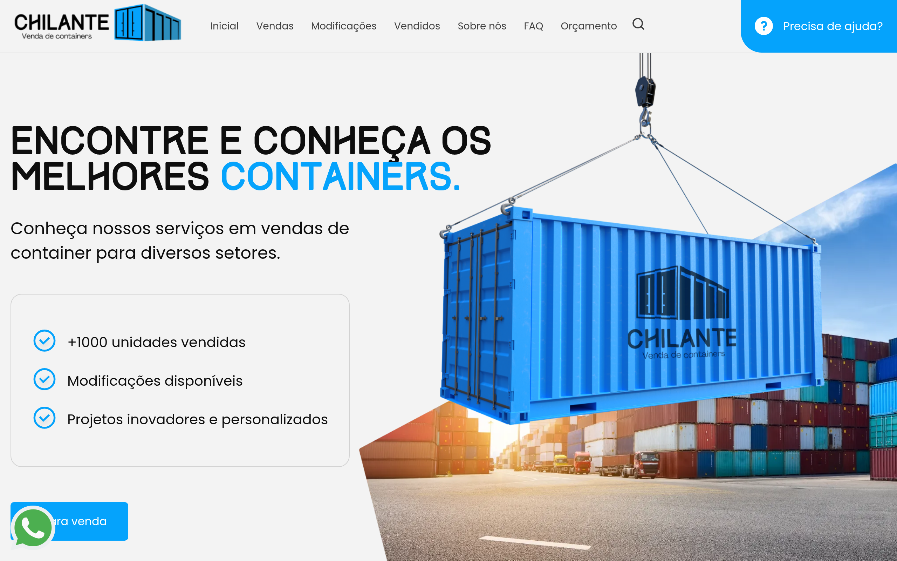

### Scroll Journey (Cinematic Visual States)

> These screenshots capture the website at different scroll depths. The design changes dramatically as you scroll — each frame shows a different cinematic state. Replicate these exact visual transitions.

#### 0% — Hero / Above the fold


#### 17% — Mid-page at 17% scroll


#### 33% — Mid-page at 33% scroll


#### 50% — Mid-page at 50% scroll


#### 67% — Mid-page at 67% scroll


#### 83% — Mid-page at 83% scroll


#### 100% — Footer / End of page


> Read `references/DESIGN.md` for full token details. Read `references/ANIMATIONS.md` for motion specs. Read `references/LAYOUT.md` for layout structure. Read `references/COMPONENTS.md` for component patterns.

## Ultra Reference Files

This package includes extended documentation. **Read these files before implementing:**

| File | Contents |
|------|----------|
| `references/DESIGN.md` | Full design system tokens, colors, typography, spacing |
| `references/VISUAL_GUIDE.md` | **START HERE** — Master visual guide with all screenshots embedded |
| `references/ANIMATIONS.md` | CSS keyframes, scroll triggers, motion library stack, video specs |
| `references/LAYOUT.md` | Flex/grid containers, page structure, spacing relationships |
| `references/COMPONENTS.md` | DOM component patterns, HTML structure, class fingerprints |
| `references/INTERACTIONS.md` | Hover/focus states with before/after style diffs |
| `screens/scroll/` | 7 scroll journey screenshots showing cinematic states |

### Animation Stack Detected

- **GSAP** v3.11.0 — animation
- **ScrollTrigger** — scroll
- **AOS (Animate On Scroll)** — scroll
- **Web Animations API (2 active)** — animation

## Design Philosophy

- **Layered depth** — use shadow tokens to create a sense of physical layering. Each elevation level has a specific shadow.
- **Gradient accents** — gradients are used thoughtfully for emphasis, not decoration.
- **Type pairing** — Track for body/UI text, Poppins for headings/display. Never introduce a third typeface.
- **standard density** — 5px base grid. Every dimension is a multiple of 5.
- **cool palette** — the color temperature runs cool, matching the sans-serif typography.
- **Restrained accent** — `#0000ee` is the only pop of color. Used exclusively for CTAs, links, focus rings, and active states.
- **Expressive motion** — animations are an integral part of the experience. Use spring physics and layout animations.

## Color System

### Core Palette

| Role | Token | Hex | Use |
|------|-------|-----|-----|
| Background | `--background` | `#18181b` | Page/app background |
| Surface | `--surface` | `#000000` | Cards, panels, modals |
| Text Primary | `--text-primary` | `#ffffff` | Headings, body text |
| Text Muted | `--text-muted` | `#404040` | Captions, placeholders |
| Accent | `--accent` | `#0000ee` | CTAs, links, focus rings |
| Border | `--border` | `#5d5d5d` | Dividers, card borders |

### Status Colors

| Status | Hex | Use |
|--------|-----|-----|
| Success | `#27c919` | Confirmations, positive trends |

### Extended Palette

- **primary:** `#05a3fc`
- `#0e0e0e` — Deep background layer or shadow color
- `#f3f3f3` — Light surface or highlight color
- `#e5e3df` — Light surface or highlight color
- `#cccccc`
- **secondary:** `#61c9f5` — Secondary text, placeholder text
- `#333333`
- `#22d5e9`

### CSS Variable Tokens

```css
--primary: #05A3FC;
--secondary: #61C9F5;
--primary: #05A3FC;
--secondary: #61C9F5;
--primary: #05A3FC;
--secondary: #61C9F5;
--primary: #05A3FC;
--secondary: #61C9F5;
--primary: #05A3FC;
--secondary: #61C9F5;
```

## Typography

### Font Stack

- **Track** — Heading 1, Heading 2, Heading 3
- **Poppins** — Body, Caption

### Font Sources

```css
@font-face {
  font-family: "Poppins";
  src: url("fonts/Poppins-Bold.ttf") format("truetype");
  font-weight: 700;
}
@font-face {
  font-family: "Poppins";
  src: url("fonts/Poppins-Regular.ttf") format("truetype");
  font-weight: 400;
}
@font-face {
  font-family: "Track";
  src: url("fonts/Track-Regular.woff2") format("woff2");
  font-weight: 400;
}
```

### Type Scale

| Role | Family | Size | Weight |
|------|--------|------|--------|
| Heading 1 | Track | 64px | 700 |
| Heading 2 | Track | 50px | 700 |
| Heading 3 | Track | 40px | 700 |
| Body | Poppins | 16px | 400 |
| Caption | Poppins | 20px | 400 |

### Typography Rules

- Body/UI: **Track**, Headings: **Poppins** — these are the only display fonts
- Max 3-4 font sizes per screen
- Headings: weight 600-700, body: weight 400
- Use color and opacity for text hierarchy, not additional font sizes
- Line height: 1.5 for body, 1.2 for headings

## Spacing & Layout

### Base Grid: 5px

Every dimension (margin, padding, gap, width, height) must be a multiple of **5px**.

### Spacing Scale

`5, 10, 15, 20, 25, 30, 35, 40, 45, 50, 60, 70` px

### Spacing as Meaning

| Spacing | Use |
|---------|-----|
| 2.5-5px | Tight: related items within a group |
| 10px | Medium: between groups |
| 15-20px | Wide: between sections |
| 30px+ | Vast: major section breaks |

### Border Radius

Scale: `0px 0px 0px 30px, 2px, 4px, 5px, 8px, 10px, 10px 10px 0px 0px, 16px, 19px, 50px 0px 8px`
Default: `10px`

### Container

Max-width: `992px`, centered with auto margins.

### Breakpoints

| Name | Value |
|------|-------|
| sm | 576px |
| sm | 640px |
| md | 768px |
| lg | 992px |
| lg | 1024px |
| xl | 1200px |
| xl | 1280px |
| 2xl | 1400px |
| 2xl | 1500px |
| 2xl | 1800px |
| 2xl | 1850px |
| 2xl | 2000px |

Mobile-first: design for small screens, layer on responsive overrides.

## Component Patterns

### Card

```css
.card {
  background: #000000;
  border: 1px solid #5d5d5d;
  border-radius: 10px;
  padding: 20px;
  box-shadow: var(--carousel-button-shadow,none);
}
```

```html
<div class="card">
  <h3>Card Title</h3>
  <p>Card content goes here.</p>
</div>
```

### Button

```css
/* Primary */
.btn-primary {
  background: #0000ee;
  color: #ffffff;
  border-radius: 10px;
  padding: 10px 20px;
  font-weight: 500;
  transition: opacity 150ms ease;
}
.btn-primary:hover { opacity: 0.9; }

/* Ghost */
.btn-ghost {
  background: transparent;
  border: 1px solid #5d5d5d;
  color: #ffffff;
  border-radius: 10px;
  padding: 10px 20px;
}
```

```html
<button class="btn-primary">Get Started</button>
<button class="btn-ghost">Learn More</button>
```

### Input

```css
.input {
  background: #18181b;
  border: 1px solid #5d5d5d;
  border-radius: 10px;
  padding: 10px 15px;
  color: #ffffff;
  font-size: 14px;
}
.input:focus { border-color: #0000ee; outline: none; }
```

```html
<input class="input" type="text" placeholder="Search..." />
```

### Badge / Chip

```css
.badge {
  display: inline-flex;
  align-items: center;
  padding: 5px 10px;
  border-radius: 9999px;
  font-size: 12px;
  font-weight: 500;
  background: #000000;
  color: #404040;
}
```

```html
<span class="badge">New</span>
<span class="badge">Beta</span>
```

### Modal / Dialog

```css
.modal-backdrop { background: rgba(0, 0, 0, 0.6); }
.modal {
  background: #000000;
  border: 1px solid #5d5d5d;
  border-radius: 50px 0px 8px;
  padding: 30px;
  max-width: 480px;
  width: 90vw;
  box-shadow: 10px 10px 25px rgb(0 0 0/10%);
}
```

```html
<div class="modal-backdrop">
  <div class="modal">
    <h2>Dialog Title</h2>
    <p>Dialog content.</p>
    <button class="btn-primary">Confirm</button>
    <button class="btn-ghost">Cancel</button>
  </div>
</div>
```

### Table

```css
.table { width: 100%; border-collapse: collapse; }
.table th {
  text-align: left;
  padding: 10px 15px;
  font-weight: 500;
  font-size: 12px;
  color: #404040;
  text-transform: uppercase;
  letter-spacing: 0.05em;
  border-bottom: 1px solid #5d5d5d;
}
.table td {
  padding: 15px;
  border-bottom: 1px solid #5d5d5d;
}
```

```html
<table class="table">
  <thead><tr><th>Name</th><th>Status</th><th>Date</th></tr></thead>
  <tbody>
    <tr><td>Item One</td><td>Active</td><td>Jan 1</td></tr>
    <tr><td>Item Two</td><td>Pending</td><td>Jan 2</td></tr>
  </tbody>
</table>
```

### Navigation

```css
.nav {
  display: flex;
  align-items: center;
  gap: 10px;
  padding: 15px 20px;
  border-bottom: 1px solid #5d5d5d;
}
.nav-link {
  color: #404040;
  padding: 10px 15px;
  border-radius: 10px;
  transition: color 150ms;
}
.nav-link:hover { color: #ffffff; }
.nav-link.active { color: #0000ee; }
```

```html
<nav class="nav">
  <a href="/" class="nav-link active">Home</a>
  <a href="/about" class="nav-link">About</a>
  <a href="/pricing" class="nav-link">Pricing</a>
  <button class="btn-primary" style="margin-left: auto">Get Started</button>
</nav>
```

## Page Structure

The following page sections were detected:

- **Navigation** — Top navigation bar (7 items)
- **Hero** — Hero section (detected from heading structure)
- **Faq** — FAQ/accordion section
- **Footer** — Page footer with links and info (21 items)

When building pages, follow this section order and structure.

## Animation & Motion

This project uses **expressive motion**. Animations are part of the design language.

### CSS Animations

- `fancybox-rotate`
- `fancybox-dash`
- `fancybox-fadeIn`
- `fancybox-fadeOut`
- `fancybox-zoomInUp`

### Motion Tokens

- **Duration scale:** `.1s`, `.15s`, `.2s`, `.25s`, `.3s`, `.35s`, `.4s`, `.45s`, `.5s`, `.55s`, `.6s`, `.65s`, `.7s`, `.75s`, `.8s`, `.85s`, `.9s`, `.95s`, `1s`, `1.05s`, `1.1s`, `1.15s`, `1.2s`, `1.25s`, `1.3s`, `1.35s`, `1.4s`, `1.45s`, `1.5s`, `1.55s`, `1.6s`, `1.65s`, `1.7s`, `1.75s`, `1.8s`, `1.85s`, `1.9s`, `1.95s`, `2s`, `2.05s`, `2.1s`, `2.15s`, `2.2s`, `2.25s`, `2.3s`, `2.35s`, `2.4s`, `2.45s`, `2.5s`, `2.55s`, `2.6s`, `2.65s`, `2.7s`, `2.75s`, `2.8s`, `2.85s`, `2.9s`, `2.95s`, `3s`, `50ms`, `150ms`, `200ms`, `300ms`, `500ms`, `600ms`, `1000ms`
- **Easing functions:** `ease-in-out`, `ease`, `linear`, `cubic-bezier(.25,.25,.75,.75)`, `ease-in`, `ease-out`, `cubic-bezier(.6,-.28,.735,.045)`, `cubic-bezier(.175,.885,.32,1.275)`, `cubic-bezier(.68,-.55,.265,1.55)`, `cubic-bezier(.47,0,.745,.715)`, `cubic-bezier(.39,.575,.565,1)`, `cubic-bezier(.445,.05,.55,.95)`, `cubic-bezier(.55,.085,.68,.53)`, `cubic-bezier(.25,.46,.45,.94)`, `cubic-bezier(.455,.03,.515,.955)`, `cubic-bezier(0,0,0.07,0.98)`, `cubic-bezier(0.99,0.3,0.15,0.74)`
- **Animated properties:** `opacity`

### Motion Guidelines

- **Duration:** Use values from the duration scale above. Short (.1s) for micro-interactions, long (1000ms) for page transitions
- **Easing:** Use `ease-in-out` as the default easing curve
- **Direction:** Elements enter from bottom/right, exit to top/left
- **Reduced motion:** Always respect `prefers-reduced-motion` — disable animations when set

## Depth & Elevation

### Shadow Tokens

- Subtle: `0 0 0 1px #fff,0 0 0 2px var(--fancybox-accent-color,rgba(1,210,232,0.94))`
- Subtle: `rgb(160, 160, 160) 0px 2px 2px 0px`
- Raised (cards, buttons): `var(--carousel-button-shadow,none)`
- Raised (cards, buttons): `inset 0 0 4px rgba(0,0,0,.2)`
- Raised (cards, buttons): `rgb(132, 129, 129) 0px 2px 4px 0px`
- Overlay (modals, dialogs): `10px 10px 25px rgb(0 0 0/10%)`

### Z-Index Scale

`0, 1, 2, 10, 20, 30, 40, 998, 999, 1000, 1050, 1053`

Use these exact values — never invent z-index values.

## Anti-Patterns (Never Do)

- **No blur effects** — no backdrop-blur, no filter: blur()
- **No zebra striping** — tables and lists use borders for separation
- **No invented colors** — every hex value must come from the palette above
- **No arbitrary spacing** — every dimension is a multiple of 5px
- **No extra fonts** — only Track and Poppins are allowed
- **No arbitrary border-radius** — use the scale: 2px, 4px, 5px, 8px, 10px, 16px, 19px
- **No opacity for disabled states** — use muted colors instead

## Workflow

1. **Read** `references/DESIGN.md` before writing any UI code
2. **Pick colors** from the Color System section — never invent new ones
3. **Set typography** — Track, Poppins only, using the type scale
4. **Build layout** on the 5px grid — check every margin, padding, gap
5. **Match components** to patterns above before creating new ones
6. **Apply elevation** — use shadow tokens
7. **Validate** — every value traces back to a design token. No magic numbers.

## Brand Spec

- **Favicon:** `https://cdn.interago.com.br/img/png/w_0_q_8/386/mc/Logo e favicon//favicon`
- **Site URL:** `https://www.vendaschilantecontainer.com.br/`
- **Brand color:** `#0000ee`
- **Brand typeface:** Track

## Quick Reference

```
Background:     #18181b
Surface:        #000000
Text:           #ffffff / #404040
Accent:         #0000ee
Border:         #5d5d5d
Font:           Track
Spacing:        5px grid
Radius:         10px
Components:     7 detected
```

## When to Trigger

Activate this skill when:
- Creating new components, pages, or visual elements for vendaschilantecontainer
- Writing CSS, Tailwind classes, styled-components, or inline styles
- Building page layouts, templates, or responsive designs
- Reviewing UI code for design consistency
- The user mentions "vendaschilantecontainer" design, style, UI, or theme
- Generating mockups, wireframes, or visual prototypes

---

# Full Reference Files

> Every output file is embedded below. Claude has full design system context from /skills alone.

## Design System Tokens (DESIGN.md)

# vendaschilantecontainer DESIGN.md

> Auto-generated design system — reverse-engineered via static analysis by skillui.
> Frameworks: None detected
> Colors: 20 · Fonts: 2 · Components: 7
> Icon library: not detected · State: not detected
> Primary theme: dark · Dark mode toggle: no · Motion: expressive

## Visual Reference

**Match this design exactly** — study colors, fonts, spacing, and component shapes before writing any UI code.


---

## 1. Visual Theme & Atmosphere

This is a **dark-themed** interface with a cool tone. Depth is expressed through layered shadows and subtle surface color variation. Typography pairs **Poppins** for display/headings with **Track** for body text, creating clear visual hierarchy through type contrast. Spacing follows a **5px base grid** (standard density), with scale: 5, 10, 15, 20, 25, 30, 35, 40px. The palette is predominantly monochromatic with **#0000ee** as the single accent color — used sparingly for interactive elements and emphasis. Motion is expressive — spring physics, layout animations, and staggered reveals are part of the visual language.

---

## 2. Color Palette & Roles

| Token | Hex | Role | Use |
|---|---|---|---|
| background | `#18181b` | background | Page background, darkest surface |
| surface | `#000000` | surface | Card and panel backgrounds |
| text-primary | `#ffffff` | text-primary | Headings and body text |
| text-muted | `#404040` | text-muted | Captions, placeholders, secondary info |
| border | `#5d5d5d` | border | Dividers, card borders, outlines |
| accent | `#0000ee` | accent | CTAs, links, focus rings, active states |
| success | `#27c919` | success | Success states, positive indicators |
| primary | `#05a3fc` | info | Informational highlights |
| unknown | `#0e0e0e` | unknown | Palette color |
| unknown | `#f3f3f3` | unknown | Palette color |
| unknown | `#e5e3df` | unknown | Palette color |
| unknown | `#cccccc` | unknown | Palette color |
| secondary | `#61c9f5` | unknown | Palette color |
| unknown | `#333333` | unknown | Palette color |
| unknown | `#22d5e9` | unknown | Palette color |
| unknown | `#ababab` | unknown | Palette color |
| unknown | `#d9d9d9` | unknown | Palette color |
| unknown | `#c1c1c1` | unknown | Palette color |
| unknown | `#00c2ff` | unknown | Palette color |
| unknown | `#374151` | unknown | Palette color |

### CSS Variable Tokens

```css
--primary: #05A3FC;
--secondary: #61C9F5;
--primary: #05A3FC;
--secondary: #61C9F5;
--primary: #05A3FC;
--secondary: #61C9F5;
--primary: #05A3FC;
--secondary: #61C9F5;
--primary: #05A3FC;
--secondary: #61C9F5;
```


---

## 3. Typography Rules

**Font Stack:**
- **Track** — Heading 1, Heading 2, Heading 3
- **Poppins** — Body, Caption

**Font Sources:**

```css
@font-face {
  font-family: "Poppins";
  src: url("fonts/Poppins-Bold.ttf") format("truetype");
  font-weight: 700;
}
@font-face {
  font-family: "Poppins";
  src: url("fonts/Poppins-Regular.ttf") format("truetype");
  font-weight: 400;
}
@font-face {
  font-family: "Track";
  src: url("fonts/Track-Regular.woff2") format("woff2");
  font-weight: 400;
}
```

| Role | Font | Size | Weight |
|---|---|---|---|
| Heading 1 | Track | 64px | 700 |
| Heading 2 | Track | 50px | 700 |
| Heading 3 | Track | 40px | 700 |
| Body | Poppins | 16px | 400 |
| Caption | Poppins | 20px | 400 |

**Typographic Rules:**
- Limit to 2 font families max per screen
- Use **Track** for body/UI text, **Poppins** for display/headings
- Maintain consistent hierarchy: no more than 3-4 font sizes per screen
- Headings use bold (600-700), body uses regular (400)
- Line height: 1.5 for body text, 1.2 for headings
- Use color and opacity for secondary hierarchy, not additional font sizes


---

## 4. Component Stylings

### Layout (1)

**Footer** — `html`

### Navigation (1)

**Navigation** — `html`

### Data Input (2)

**Button** — `html`
- Animation: 

**Input** — `html`
- State: :focus, :placeholder

### Media (3)

**Image** — `html`

**Icon** — `html`

**Map/Canvas** — `html`


---

## 5. Layout Principles

- **Base spacing unit:** 5px
- **Spacing scale:** 5, 10, 15, 20, 25, 30, 35, 40, 45, 50, 60, 70
- **Border radius:** 0px 0px 0px 30px, 2px, 4px, 5px, 8px, 10px, 10px 10px 0px 0px, 16px, 19px, 50px 0px 8px
- **Max content width:** 992px

**Spacing as Meaning:**
| Spacing | Use |
|---|---|
| 2.5-5px | Tight: related items within a group |
| 10px | Medium: between groups |
| 15-20px | Wide: between sections |
| 30px+ | Vast: major section breaks |


---

## 6. Depth & Elevation

### Flat — subtle depth hints

- `0 0 0 1px #fff,0 0 0 2px var(--fancybox-accent-color,rgba(1,210,232,0.94))`
- `rgb(160, 160, 160) 0px 2px 2px 0px`

### Raised — cards, buttons, interactive elements

- `var(--carousel-button-shadow,none)`
- `inset 0 0 4px rgba(0,0,0,.2)`
- `rgb(132, 129, 129) 0px 2px 4px 0px`

### Overlay — full-screen overlays, top-level dialogs

- `10px 10px 25px rgb(0 0 0/10%)`
- `0px 0px 24px rgb(0 0 0/10%)`
- `0px 4px 32px 0px rgba(0,91,130,0.16)`

### Z-Index Scale

`0, 1, 2, 10, 20, 30, 40, 998, 999, 1000, 1050, 1053`


---

## 7. Animation & Motion

This project uses **expressive motion**. Animations are an integral part of the experience.

### CSS Animations

- `@keyframes fancybox-rotate`
- `@keyframes fancybox-dash`
- `@keyframes fancybox-fadeIn`
- `@keyframes fancybox-fadeOut`
- `@keyframes fancybox-zoomInUp`
- `@keyframes fancybox-zoomOutDown`
- `@keyframes fancybox-throwOutUp`
- `@keyframes fancybox-throwOutDown`

### Animated Components

- **Button**: 

### Motion Guidelines

- Duration: 150-300ms for micro-interactions, 300-500ms for page transitions
- Easing: `ease-out` for enters, `ease-in` for exits
- Always respect `prefers-reduced-motion`


---

## 8. Do's and Don'ts

### Do's

- Use `#0000ee` for interactive elements (buttons, links, focus rings)
- Use `#18181b` as the primary page background
- Pair **Track** (body) with **Poppins** (display) — these are the only allowed fonts
- Follow the **5px** spacing grid for all margins, padding, and gaps
- Use the defined shadow tokens for elevation — see Section 6
- Use border-radius from the scale: 0px 0px 0px 30px, 2px, 4px, 5px, 8px
- Reuse existing components from Section 4 before creating new ones

### Don'ts

- Don't introduce colors outside this palette — extend the design tokens first
- Don't introduce additional font families beyond Track and Poppins
- Don't use arbitrary spacing values — stick to multiples of 5px
- Don't create custom box-shadow values outside the system tokens
- Don't use arbitrary border-radius values — pick from the defined scale
- Don't duplicate component patterns — check Section 4 first
- Don't use backdrop-blur or blur effects

### Anti-Patterns (detected from codebase)

- No blur or backdrop-blur effects
- No zebra striping on tables/lists


---

## 9. Responsive Behavior

| Name | Value | Source |
|---|---|---|
| sm | 576px | css |
| sm | 640px | css |
| md | 768px | css |
| lg | 992px | css |
| lg | 1024px | css |
| xl | 1200px | css |
| xl | 1280px | css |
| 2xl | 1400px | css |
| 2xl | 1500px | css |
| 2xl | 1800px | css |
| 2xl | 1850px | css |
| 2xl | 2000px | css |

**Approach:** Use `@media (min-width: ...)` queries matching the breakpoints above.


---

## 10. Agent Prompt Guide

Use these as starting points when building new UI:

### Build a Card

```
Background: #000000
Border: 1px solid #5d5d5d
Radius: 10px
Padding: 20px
Font: Track
Use shadow tokens from Section 6.
```

### Build a Button

```
Primary: bg #0000ee, text white
Ghost: bg transparent, border #5d5d5d
Padding: 10px 20px
Radius: 10px
Hover: opacity 0.9 or lighter shade
Focus: ring with #0000ee
```

### Build a Page Layout

```
Background: #18181b
Max-width: 992px, centered
Grid: 5px base
Responsive: mobile-first, breakpoints from Section 9
```

### Build a Stats Card

```
Surface: #000000
Label: #404040 (muted, 12px, uppercase)
Value: #ffffff (primary, 24-32px, bold)
Status: use success/warning/danger from Section 2
```

### Build a Form

```
Input bg: #18181b
Input border: 1px solid #5d5d5d
Focus: border-color #0000ee
Label: #404040 12px
Spacing: 20px between fields
Radius: 10px
```

### General Component

```
1. Read DESIGN.md Sections 2-6 for tokens
2. Colors: only from palette
3. Font: Track, type scale from Section 3
4. Spacing: 5px grid
5. Components: match patterns from Section 4
6. Elevation: shadow tokens
```

## Visual Guide — Screenshots (VISUAL_GUIDE.md)

# vendaschilantecontainer — Visual Guide

> Master visual reference. Study every screenshot carefully before implementing any UI.
> Match colors, layout, typography, spacing, and motion states exactly.

**Motion Stack:** **GSAP**, **ScrollTrigger**, **AOS (Animate On Scroll)**, **Web Animations API (2 active)**

## Scroll Journey

The page has cinematic scroll animations. Each screenshot below shows the exact visual state at that scroll depth.
**Replicate these transitions precisely** — the design changes dramatically as you scroll.

### Hero — Above the fold

*Scroll position: 0px of 4447px total*


### 17% scroll depth

*Scroll position: 603px of 4447px total*


### 33% scroll depth

*Scroll position: 1171px of 4447px total*


### 50% scroll depth

*Scroll position: 1774px of 4447px total*


### 67% scroll depth

*Scroll position: 2376px of 4447px total*


### 83% scroll depth

*Scroll position: 2944px of 4447px total*


### Footer — End of page

*Scroll position: 3547px of 4447px total*


## Full Page Screenshots

### Chilante Venda e personalização de Containers

*URL: `https://www.vendaschilantecontainer.com.br/`*


### Chilante Venda e personalização de Containers

*URL: `https://www.vendaschilantecontainer.com.br/index`*


### Catálogo de Produtos de Chilante Containers

*URL: `https://www.vendaschilantecontainer.com.br/vendas/index`*


### Modificações | Chilante Containers

*URL: `https://www.vendaschilantecontainer.com.br/modificacoes`*


### Vendidos | Chilante Containers

*URL: `https://www.vendaschilantecontainer.com.br/vendidos`*


## Section Screenshots

Clipped sections showing individual components in context.

### Section 1 — `section`

*1440×829px*


### Section 1 — `section`

*1440×829px*


### Section 1 — `section`

*1440×602px*


### Section 2 — `section`

*1440×1080px*


### Section 1 — `section`

*1440×1200px*


### Section 1 — `section`

*1440×955px*


## Animations & Motion (ANIMATIONS.md)

# Animation Reference

> Cinematic motion design extracted from live DOM. Follow these specs exactly to recreate the experience.

## Motion Technology Stack

| Library | Type | Notes |
|---------|------|-------|
| **GSAP v3.11.0** | animation |  |
| **ScrollTrigger** | scroll |  |
| **AOS (Animate On Scroll)** | scroll |  |
| **Web Animations API (2 active)** | animation |  |

## Scroll Journey

The page is **4.447px** tall. Each frame below shows what the user sees at that scroll depth.

> **Use these screenshots to understand WHAT animates, WHEN it animates, and HOW it moves.**

### 0% — Top / Hero
Scroll position: 0px


### 17% — Opening Section
Scroll position: 603px


### 33% — First Feature Section
Scroll position: 1.171px


### 50% — Mid-Page
Scroll position: 1.774px


### 67% — Lower Content
Scroll position: 2.376px


### 83% — Near Footer
Scroll position: 2.944px


### 100% — Bottom / Footer
Scroll position: 3.547px


## Scroll Animation Patterns

| Pattern | Library | Element Count | Duration | Delay | Easing |
|---------|---------|---------------|----------|-------|--------|
| parallax / sticky scroll | CSS | 5 | — | — | — |

### CSS Implementation

## CSS Keyframes (5 extracted)

### `@keyframes pumpInWhatsappButton`

Duration: `0.5s` · Easing: `ease-out` · Delay: `0s` · Iteration: `1` · Fill: `forwards`

Used by: `#whatsapp-button-page`

```css
@keyframes pumpInWhatsappButton {
  0% {
    opacity: 1;
    transform: scale(1);
  }
  30% {
    opacity: 1;
    transform: scale(1.2);
  }
  80% {
    transform: scale(0.9);
  }
  100% {
    opacity: 1;
    transform: scale(1);
  }
}
```

> Fade + motion enter animation

### `@keyframes shake-whatsappbutton`

Duration: `1s` · Easing: `cubic-bezier(0.36, 0.07, 0.19, 0.97)` · Delay: `0s` · Iteration: `1` · Fill: `both`

Used by: `#whatsapp-button-page:hover`

```css
@keyframes shake-whatsappbutton {
  10%, 90% {
    transform: translate3d(-1px, 0px, 0px);
  }
  20%, 80% {
    transform: translate3d(2px, 0px, 0px);
  }
  30%, 50%, 70% {
    transform: translate3d(-3px, 0px, 0px);
  }
  40%, 60% {
    transform: translate3d(2px, 0px, 0px);
  }
}
```

> Transform/motion animation

### `@keyframes slideInFromBottom`

Duration: `0.5s` · Easing: `cubic-bezier(0.25, 0.46, 0.45, 0.94)` · Delay: `0s` · Iteration: `1` · Fill: `both`

Used by: `#whatsapp-number-form`

```css
@keyframes slideInFromBottom {
  0% {
    transform: translateY(1000px);
    opacity: 0;
  }
  50% {
    transform: translateY(-30px);
    opacity: 1;
  }
  100% {
    transform: translateY(0px);
    opacity: 1;
  }
}
```

> Fade + motion enter animation

### `@keyframes slide-in-bottom`

Duration: `0.5s` · Easing: `cubic-bezier(0.25, 0.46, 0.45, 0.94)` · Delay: `0s` · Iteration: `1` · Fill: `both`

Used by: `.slide-in-bottom-eco-cookie`

```css
@keyframes slide-in-bottom {
  0% {
    transform: translateY(1000px);
    opacity: 0;
  }
  100% {
    transform: translateY(0px);
    opacity: 1;
  }
}
```

> Fade + motion enter animation

### `@keyframes slide-in-bottom`

Duration: `0.5s` · Easing: `cubic-bezier(0.25, 0.46, 0.45, 0.94)` · Delay: `0s` · Iteration: `1` · Fill: `both`

Used by: `.slide-in-bottom-eco-cookie`

```css
@keyframes slide-in-bottom {
  0% {
    transform: translateY(1000px);
    opacity: 0;
  }
  100% {
    transform: translateY(0px);
    opacity: 1;
  }
}
```

> Fade + motion enter animation

## Global Transition Declarations

These `transition` values were extracted from CSS rules across the site:

```css
transition: 0.3s;
transition: 1s;
transition: 1s cubic-bezier(0, 0, 0.07, 0.98);
transition: 0.5s;
transition: max-height 1s, opacity 0.5s;
transition: 0.5s ease-in-out;
transition: 0.5s cubic-bezier(0.99, 0.3, 0.15, 0.74);
transition: 0.6s ease-in-out;
transition: background 0.2s ease-out;
transition: 0.2s ease-out;
transition: opacity 0.2s ease-out;
```

## How to Recreate This Motion Design

### Step 1 — Install Dependencies

```bash
npm install gsap
npm install gsap
npm install aos
```

### Step 2 — Scroll-Reveal Pattern

Elements that animate into view follow this pattern:

```css
/* Initial hidden state */
.reveal {
  opacity: 0;
  transform: translateY(40px);
  transition: opacity 0.3s cubic-bezier(0.4, 0, 0.2, 1),
              transform 0.3s cubic-bezier(0.4, 0, 0.2, 1);
}
.reveal.visible {
  opacity: 1;
  transform: translateY(0);
}
```

### Step 3 — Key Motion Principles

- **GSAP ScrollTrigger** — scroll-linked animations (product rotation, parallax) use `ScrollTrigger.scrub` for frame-perfect scroll sync
- **Duration scale:** `0.3s` · `1s` · `0.5s` — use these values, never invent new durations
- **Always add** `@media (prefers-reduced-motion: reduce) { * { animation-duration: 0.01ms !important; transition-duration: 0.01ms !important; } }`

### Step 4 — Scroll Journey Reference

Match what happens at each scroll position:

- **0%** (`0px`) → `screens/scroll/scroll-000.png`
- **17%** (`603px`) → `screens/scroll/scroll-017.png`
- **33%** (`1171px`) → `screens/scroll/scroll-033.png`
- **50%** (`1774px`) → `screens/scroll/scroll-050.png`
- **67%** (`2376px`) → `screens/scroll/scroll-067.png`
- **83%** (`2944px`) → `screens/scroll/scroll-083.png`
- **100%** (`3547px`) → `screens/scroll/scroll-100.png`

## Layout & Grid (LAYOUT.md)

# Layout Reference

> Auto-extracted from live DOM. Use this to understand how the site is structured spatially.

## Spacing System

**Base grid:** 5px

**Scale:** `5, 10, 15, 20, 25, 30, 35, 40, 45, 50, 60, 70, 80, 90, 100` px

| Spacing | Semantic Use |
|---------|-------------|
| 5px | Tight — within a component |
| 10px | Medium — between sibling items |
| 20px | Wide — between sections |
| 40px | Vast — major section breaks |

## Flex Layouts

| Element | Direction | Justify | Align | Gap | Children |
|---------|-----------|---------|-------|-----|----------|
| `div.container` | row | space-between | center | — | 2 |
| `div.container.showUp` | column | center | center | — | 2 |
| `nav.active` | row | — | center | 15px | 5 |
| `div.col-12.col-lg-5` | column | center | — | — | 1 |

## Grid Layouts

| Element | Template Columns | Gap | Children |
|---------|-----------------|-----|----------|
| `div.row` | `95.8281px 95.8281px 95.8281px 95.8281px 95.8281px ` | 20px | 2 |
| `div.row` | `95.8281px 95.8281px 95.8281px 95.8281px 95.8281px ` | 20px | 3 |
| `div.row` | `95.8281px 95.8281px 95.8281px 95.8281px 95.8281px ` | 20px | 2 |
| `div.row` | `94.8281px 94.8281px 94.8281px 106.734px 94.8438px ` | 20px | 5 |
| `div.row.parallaxVertical` | `47.5625px 47.5625px 47.5625px 47.5625px 47.5625px ` | 20px | 4 |

## Structural Containers

### `<header>` (`header#jsHeader`)

```
display:          block
children:         2
```

### `<footer>` 

```
display:          block
padding:          100px 0px 0px
children:         2
```

### `<section>` (`section.sectionBanner.active`)

```
display:          block
padding:          100px 0px
children:         2
```

### `<section>` (`section.sectionSobre`)

```
display:          block
padding:          70px 0px
children:         1
```

### `<section>` (`section.sectionProjetos`)

```
display:          block
padding:          100px 0px
children:         1
```

### `<section>` (`section.sectionGuia`)

```
display:          block
padding:          50px 0px
children:         1
```

### `<section>` (`section.sectionVendidos`)

```
display:          block
padding:          100px 0px
children:         1
```

### `<section>` (`section.sectionCta`)

```
display:          block
padding:          200px 0px
children:         2
```

### `<nav>` (`nav.active`)

```
display:          flex
flex-direction:   row
justify-content:  —
align-items:      center
gap:              15px
children:         5
```

## Layout Rules

- **Container max-width:** `1400px` — always center with `margin: auto`
- Primary layout system: **Flexbox**
- Secondary layout system: **CSS Grid** (used for card grids and multi-column layouts)
- Every spacing value must be a multiple of **5px**
- Never use arbitrary margin/padding values outside the spacing scale

## Component Patterns (COMPONENTS.md)

# Component Reference

> Repeated DOM patterns detected by structural analysis. Each component appeared 3+ times.

## Detected Components

| Component | Category | Instances | Key Classes |
|-----------|----------|-----------|-------------|
| **Active** | list-item | 7× | `.active` |
| **Container** | unknown | 5× | `.container` |
| **Btn** | button | 4× | `.btn`, `.btnPrimary` |
| **Col 6** | unknown | 4× | `.col-6` |
| **CardGuia** | card | 3× | `.cardGuia` |
| **NomeGuia** | unknown | 3× | `.nomeGuia` |
| **Title** | unknown | 3× | `.title`, `.txtGuia` |
| **TextoLink** | unknown | 3× | `.textoLink` |
| **ChevronGroup** | unknown | 3× | `.chevronGroup` |
| **FooterTitle** | unknown | 3× | `.footerTitle` |
| **FooterList** | unknown | 3× | `.footerList` |

## Cards

### CardGuia

**Instances found:** 3

**CSS classes:** `.cardGuia`

**HTML structure:**

```html
<a href="perguntas-frequentes" title="Ver detalhes de FAQ" class="cardGuia"> <div class="txtBox"> <p class="nomeGuia">FAQ</p> <p class="txtGuia title">Tem alguma dúvida?</p> </div> <p class="textoLink">Acesse nosso FAQ</p> <div class="chevronGroup">  </div> </a>
```

**Base styles (from design tokens):**

```css
.cardGuia {
  background: #000000;
  border: 1px solid #5d5d5d;
  border-radius: 10px;
  padding: 10px;
}```

## List Items

### Active

**Instances found:** 7

**CSS classes:** `.active`

**HTML structure:**

```html
<li class="active"><a href="index" title="Ir para página inicial">Inicial</a></li>
```

**Base styles (from design tokens):**

```css
.active {
  padding: 5px 0;
  border-bottom: 1px solid #5d5d5d;
}```

## Buttons

### Btn

**Instances found:** 4

**CSS classes:** `.btn` `.btnPrimary`

**HTML structure:**

```html
<a href="vendas/index" class="btn btnPrimary">Ir para venda</a>
```

**Base styles (from design tokens):**

```css
.btn {
  background: #0000ee;
  color: #ffffff;
  border-radius: 10px;
  padding: 5px 10px;
  cursor: pointer;
}```

## Other Components

### Container

**Instances found:** 5

**CSS classes:** `.container`

**HTML structure:**

```html
<div class="container"> <div class="navBar"> <div class="logo active"> <a href="index" title="Ir para a Página Inicial" rel="nofollow">  </a> </div> <nav class="active"> <!-- <div class="toggleSearch toggleSearchMobile">  </div> --> <input class="menuBtn" type="checkbox" id="menuBtn"> <label onclick="overlayLeft()" class="menuIcon" for
```

**Base styles (from design tokens):**

```css
.container {
  background: #000000;
  padding: 5px;
}```

### Col 6

**Instances found:** 4

**CSS classes:** `.col-6`

**HTML structure:**

```html
<div class="col-6">  </div>
```

**Base styles (from design tokens):**

```css
.col-6 {
  background: #000000;
  padding: 5px;
}```

### NomeGuia

**Instances found:** 3

**CSS classes:** `.nomeGuia`

**HTML structure:**

```html
<p class="nomeGuia">FAQ</p>
```

**Base styles (from design tokens):**

```css
.nomeGuia {
  background: #000000;
  padding: 5px;
}```

### Title

**Instances found:** 3

**CSS classes:** `.title` `.txtGuia`

**HTML structure:**

```html
<p class="txtGuia title">Tem alguma dúvida?</p>
```

**Base styles (from design tokens):**

```css
.title {
  background: #000000;
  padding: 5px;
}```

### TextoLink

**Instances found:** 3

**CSS classes:** `.textoLink`

**HTML structure:**

```html
<p class="textoLink">Acesse nosso FAQ</p>
```

**Base styles (from design tokens):**

```css
.textoLink {
  background: #000000;
  padding: 5px;
}```

### ChevronGroup

**Instances found:** 3

**CSS classes:** `.chevronGroup`

**HTML structure:**

```html
<div class="chevronGroup">  </div>
```

**Base styles (from design tokens):**

```css
.chevronGroup {
  background: #000000;
  padding: 5px;
}```

### FooterTitle

**Instances found:** 3

**CSS classes:** `.footerTitle`

**HTML structure:**

```html
<div class="footerTitle"> <h2>WEBSITE</h2> </div>
```

**Base styles (from design tokens):**

```css
.footerTitle {
  background: #000000;
  padding: 5px;
}```

### FooterList

**Instances found:** 3

**CSS classes:** `.footerList`

**HTML structure:**

```html
<ul class="footerList"> <li><a href="index" rel="nofollow" title="Ir para página inicial">Inicial</a></li> <li><a href="vendas/index" rel="nofollow" title="Ver Vendas da Chilante">Vendas</a></li> <li><a href="modificacoes" rel="nofollow" title="Ver Modificações da Chilante">Modificações</a></li> <li><a href="vendidos" rel="nofollow" title="Ver containers vendidos da Chilante">Vendidos</a></li> <li><a href="sobre-nos" rel="nofollow" title="Ver mais sobre a Chilante">Sobre nós</a></li> <li><a href="perguntas-frequentes" rel="nofollow" title="Ver FAQ da Chilante">FAQ</a></li> </ul>
```

**Base styles (from design tokens):**

```css
.footerList {
  background: #000000;
  padding: 5px;
}```

## Component Rules

- Match class names exactly from the patterns above
- Each component instance must be visually identical to others of its type
- Do not add extra wrappers or change the DOM structure
- Use `#5d5d5d` for all dividers within components
- Use `#0000ee` for all interactive/active states

## Interactions & States (INTERACTIONS.md)

# Interaction Reference

> Micro-interactions extracted from live DOM. Recreate these exactly for authentic feel.

## Coverage

| Component Type | Count | States Captured |
|----------------|-------|----------------|
| Button | 2 | default, hover, focus |
| Link | 3 | default, hover, focus |

## Transition System

These transition declarations were extracted from interactive elements:

```css
transition: 0.5s;
transition: all;
transition: 0.3s;
```

Apply these to all interactive elements. Never invent new durations or easings.

## Button Interactions

### Button 1 — `submit`

**States:**

- Default: `../screens/states/button-1-default.png`
- Hover: `../screens/states/button-1-hover.png`
- Focus: `../screens/states/button-1-focus.png`

**Transition:** `0.5s`

_No visible style changes detected for this element._

### Button 2 — `OK`

**States:**

- Default: `../screens/states/button-2-default.png`
- Hover: `../screens/states/button-2-hover.png`
- Focus: `../screens/states/button-2-focus.png`

**On focus:**

```css
/* outline: rgb(51, 51, 51) none 3px → */ outline: rgb(16, 16, 16) auto 1px;
/* outline-color: rgb(51, 51, 51) → */ outline-color: rgb(16, 16, 16);
```

**Transition:** `all`

## Link Interactions

### Link 1 — `a`

**States:**

- Default: `../screens/states/link-1-default.png`
- Hover: `../screens/states/link-1-hover.png`
- Focus: `../screens/states/link-1-focus.png`

**Transition:** `0.3s`

_No visible style changes detected for this element._

### Link 2 — `Inicial`

**States:**

- Default: `../screens/states/link-2-default.png`
- Hover: `../screens/states/link-2-hover.png`
- Focus: `../screens/states/link-2-focus.png`

**On hover:**

```css
/* color: rgb(64, 64, 64) → */ color: rgb(5, 163, 252);
/* border-color: rgb(64, 64, 64) → */ border-color: rgb(5, 163, 252);
/* outline: rgb(64, 64, 64) none 3px → */ outline: rgb(5, 163, 252) none 3px;
/* outline-color: rgb(64, 64, 64) → */ outline-color: rgb(5, 163, 252);
```

**Transition:** `0.3s`

### Link 3 — `Vendas`

**States:**

- Default: `../screens/states/link-3-default.png`
- Hover: `../screens/states/link-3-hover.png`
- Focus: `../screens/states/link-3-focus.png`

**On hover:**

```css
/* color: rgb(64, 64, 64) → */ color: rgb(5, 163, 252);
/* border-color: rgb(64, 64, 64) → */ border-color: rgb(5, 163, 252);
/* outline: rgb(64, 64, 64) none 3px → */ outline: rgb(5, 163, 252) none 3px;
/* outline-color: rgb(64, 64, 64) → */ outline-color: rgb(5, 163, 252);
```

**Transition:** `0.3s`

## Interaction Rules

- Accent color `#0000ee` is used for focus rings, active states, and hover highlights
- Hover effects include **color transitions** — use the extracted values, not approximations
- Focus states use **outline** (not box-shadow) — always match the extracted focus ring
- Transition durations in use: `0.5s`, `0.3s`
- Always respect `prefers-reduced-motion` — set all transitions to `0s` when enabled

## Design Tokens — JSON Files

### tokens/colors.json
```json
{
  "$schema": "https://design-tokens.github.io/community-group/format/",
  "core": {
    "background": {
      "value": "#18181b",
      "role": "background"
    },
    "text-primary": {
      "value": "#ffffff",
      "role": "text-primary"
    },
    "surface": {
      "value": "#000000",
      "role": "surface"
    },
    "text-muted": {
      "value": "#404040",
      "role": "text-muted"
    },
    "border": {
      "value": "#5d5d5d",
      "role": "border"
    },
    "accent": {
      "value": "#0000ee",
      "role": "accent"
    }
  },
  "status": {
    "success": {
      "value": "#27c919",
      "role": "success"
    }
  },
  "extended": {
    "primary": {
      "value": "#05a3fc",
      "role": "info",
      "name": "primary"
    },
    "color-0e0e0e": {
      "value": "#0e0e0e",
      "role": "unknown"
    },
    "color-f3f3f3": {
      "value": "#f3f3f3",
      "role": "unknown"
    },
    "color-e5e3df": {
      "value": "#e5e3df",
      "role": "unknown"
    },
    "color-cccccc": {
      "value": "#cccccc",
      "role": "unknown"
    },
    "secondary": {
      "value": "#61c9f5",
      "role": "unknown",
      "name": "secondary"
    },
    "color-333333": {
      "value": "#333333",
      "role": "unknown"
    },
    "color-22d5e9": {
      "value": "#22d5e9",
      "role": "unknown"
    },
    "color-ababab": {
      "value": "#ababab",
      "role": "unknown"
    },
    "color-d9d9d9": {
      "value": "#d9d9d9",
      "role": "unknown"
    },
    "color-c1c1c1": {
      "value": "#c1c1c1",
      "role": "unknown"
    },
    "color-00c2ff": {
      "value": "#00c2ff",
      "role": "unknown"
    },
    "color-374151": {
      "value": "#374151",
      "role": "unknown"
    }
  },
  "meta": {
    "theme": "dark",
    "extracted": "2026-06-02"
  }
}
```

### tokens/spacing.json
```json
{
  "base": {
    "value": "5px",
    "description": "Grid unit — all spacing must be multiples of this"
  },
  "unit": "px",
  "scale": {
    "xs": {
      "value": "5px",
      "px": 5
    },
    "sm": {
      "value": "10px",
      "px": 10
    },
    "md": {
      "value": "15px",
      "px": 15
    },
    "lg": {
      "value": "20px",
      "px": 20
    },
    "xl": {
      "value": "25px",
      "px": 25
    },
    "2xl": {
      "value": "30px",
      "px": 30
    },
    "3xl": {
      "value": "35px",
      "px": 35
    },
    "4xl": {
      "value": "40px",
      "px": 40
    },
    "5xl": {
      "value": "45px",
      "px": 45
    },
    "6xl": {
      "value": "50px",
      "px": 50
    }
  },
  "multipliers": {
    "1x": {
      "value": "5px",
      "raw": 5
    },
    "2x": {
      "value": "10px",
      "raw": 10
    },
    "3x": {
      "value": "15px",
      "raw": 15
    },
    "4x": {
      "value": "20px",
      "raw": 20
    },
    "5x": {
      "value": "25px",
      "raw": 25
    },
    "6x": {
      "value": "30px",
      "raw": 30
    },
    "7x": {
      "value": "35px",
      "raw": 35
    },
    "8x": {
      "value": "40px",
      "raw": 40
    },
    "9x": {
      "value": "45px",
      "raw": 45
    },
    "10x": {
      "value": "50px",
      "raw": 50
    },
    "11x": {
      "value": "55px",
      "raw": 55
    },
    "12x": {
      "value": "60px",
      "raw": 60
    },
    "13x": {
      "value": "65px",
      "raw": 65
    },
    "14x": {
      "value": "70px",
      "raw": 70
    },
    "15x": {
      "value": "75px",
      "raw": 75
    },
    "16x": {
      "value": "80px",
      "raw": 80
    }
  },
  "meta": {
    "totalValues": 15,
    "min": 5,
    "max": 100
  }
}
```

### tokens/typography.json
```json
{
  "families": [
    "Track",
    "Poppins"
  ],
  "scale": {
    "heading-1": {
      "fontFamily": "Track",
      "fontSize": "64px",
      "fontWeight": "700",
      "lineHeight": null,
      "source": "css"
    },
    "heading-2": {
      "fontFamily": "Track",
      "fontSize": "50px",
      "fontWeight": "700",
      "lineHeight": null,
      "source": "css"
    },
    "heading-3": {
      "fontFamily": "Track",
      "fontSize": "40px",
      "fontWeight": "700",
      "lineHeight": null,
      "source": "css"
    },
    "body": {
      "fontFamily": "Poppins",
      "fontSize": "16px",
      "fontWeight": "400",
      "lineHeight": null,
      "source": "css"
    },
    "caption": {
      "fontFamily": "Poppins",
      "fontSize": "20px",
      "fontWeight": "400",
      "lineHeight": null,
      "source": "css"
    }
  },
  "fontFaces": [
    {
      "family": "Poppins",
      "src": "https://fonts.gstatic.com/s/poppins/v24/pxiEyp8kv8JHgFVrFJA.ttf",
      "format": "truetype",
      "weight": "400"
    },
    {
      "family": "Poppins",
      "src": "https://fonts.gstatic.com/s/poppins/v24/pxiByp8kv8JHgFVrLEj6V1s.ttf",
      "format": "truetype",
      "weight": "600"
    },
    {
      "family": "Poppins",
      "src": "https://fonts.gstatic.com/s/poppins/v24/pxiByp8kv8JHgFVrLCz7V1s.ttf",
      "format": "truetype",
      "weight": "700"
    },
    {
      "family": "Poppins",
      "src": "https://fonts.gstatic.com/s/poppins/v24/pxiByp8kv8JHgFVrLDD4V1s.ttf",
      "format": "truetype",
      "weight": "800"
    },
    {
      "family": "Track",
      "src": "https://www.interago.com.br/App/Sites/386/mc/Fontes/Track/Track.woff2",
      "format": "woff2",
      "weight": "400"
    },
    {
      "family": "Track",
      "src": "https://www.interago.com.br/App/Sites/386/mc/Fontes/Track/Track.woff",
      "format": "woff2",
      "weight": "400"
    }
  ],
  "rules": {
    "maxSizesPerScreen": 4,
    "headingWeightRange": "600-700",
    "bodyWeight": 400,
    "lineHeightBody": 1.5,
    "lineHeightHeading": 1.2
  }
}
```

## Bundled Fonts (fonts/)

The following font files are bundled in the `fonts/` directory:

- `fonts/Poppins-Black.ttf`
- `fonts/Poppins-Bold.ttf`
- `fonts/Poppins-ExtraBold.ttf`
- `fonts/Poppins-ExtraLight.ttf`
- `fonts/Poppins-Light.ttf`
- `fonts/Poppins-Medium.ttf`
- `fonts/Poppins-Regular.ttf`
- `fonts/Poppins-SemiBold.ttf`
- `fonts/Poppins-Thin.ttf`
- `fonts/Track-Regular.woff`
- `fonts/Track-Regular.woff2`

Use these local font files in `@font-face` declarations instead of fetching from Google Fonts.

## Screenshots Inventory (screens/)

> Study all screenshots carefully before implementing any UI. Match every visual detail exactly.

### Scroll Journey (screens/scroll/)

*Cinematic scroll states — page visual at each scroll depth*


### Full Page Screenshots (screens/pages/)

*Full-page screenshots of each crawled URL*


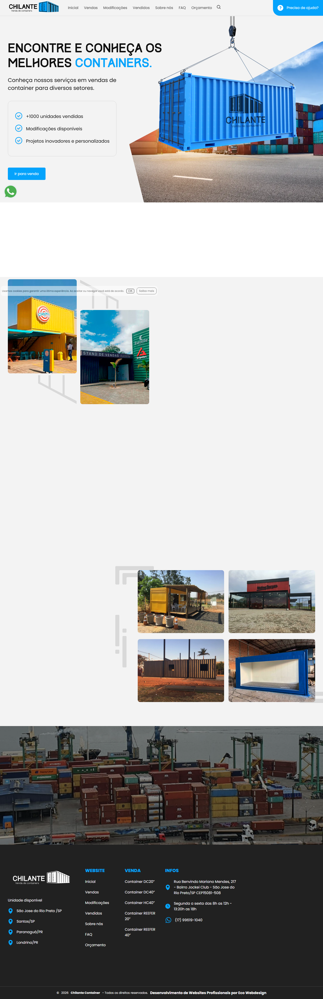

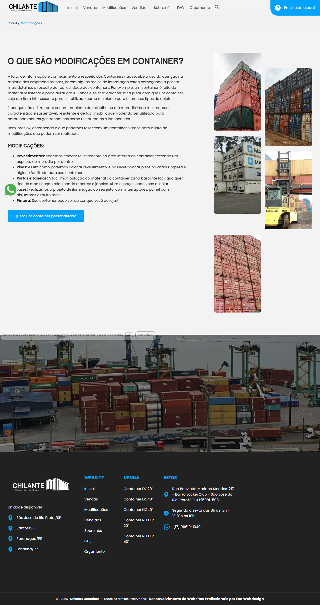

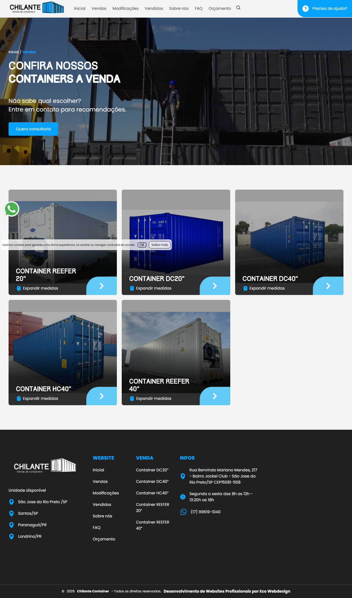

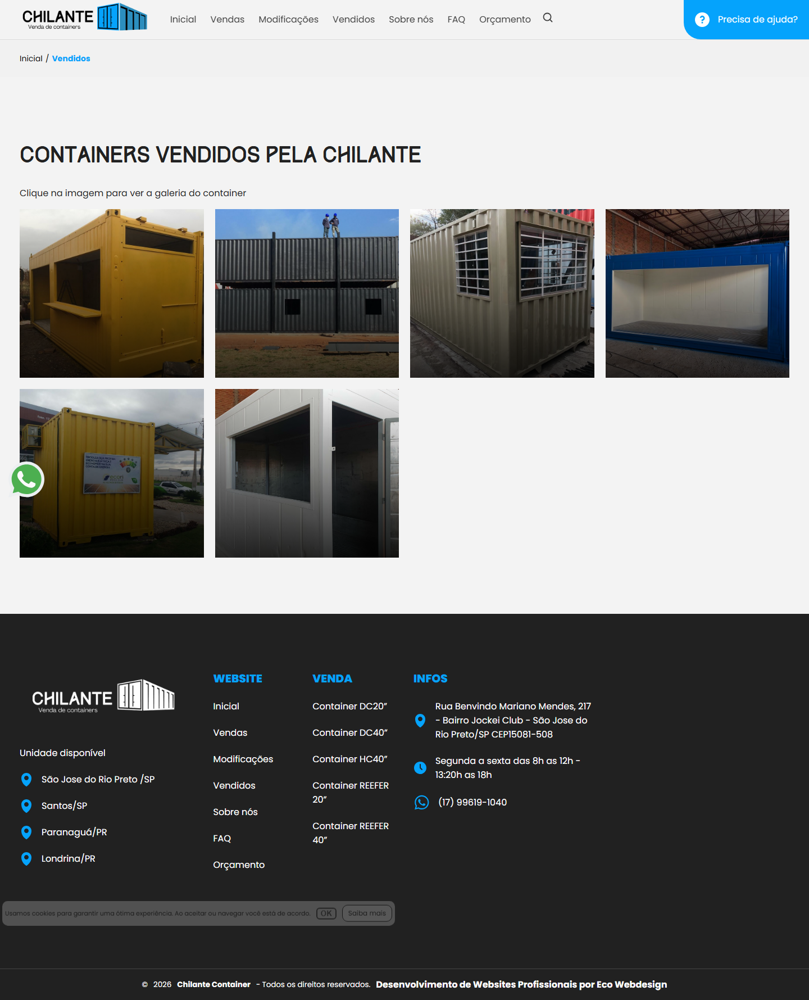

### Section Clips (screens/sections/)

*Clipped individual sections and components*


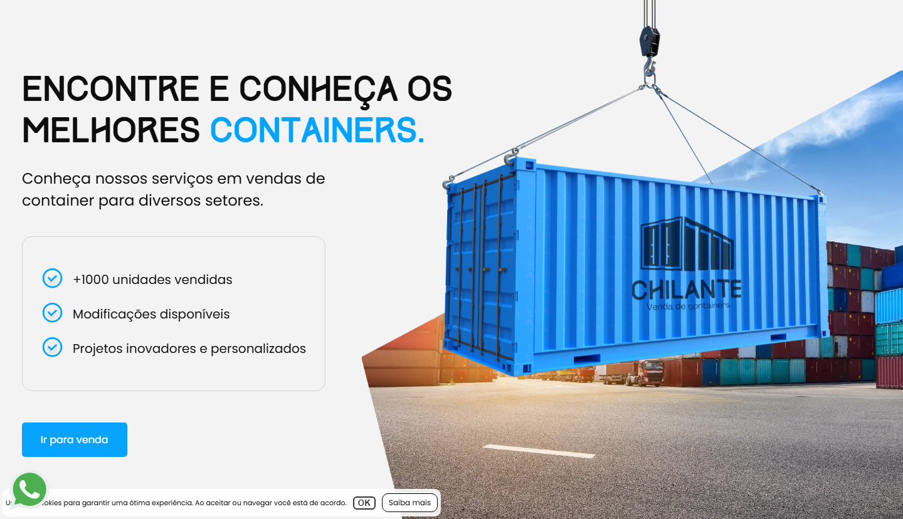

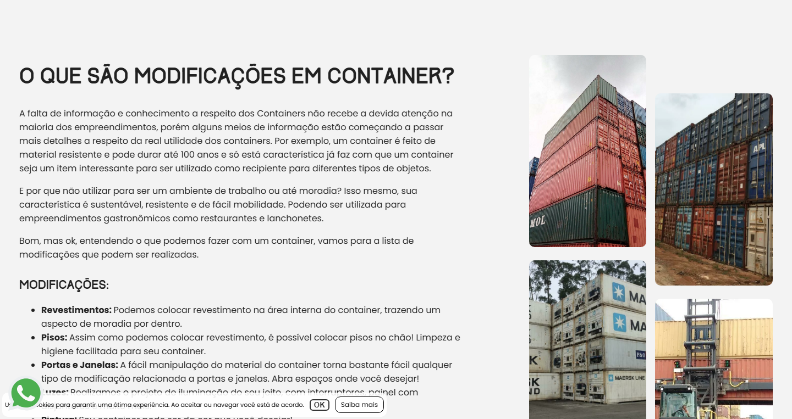

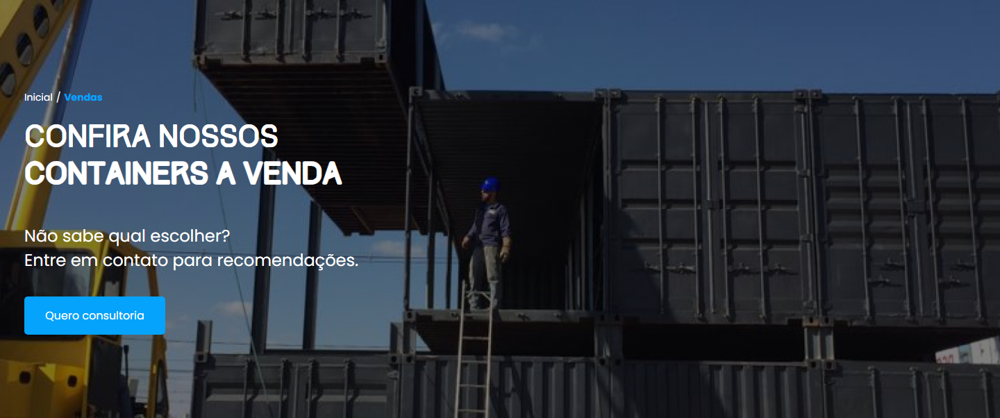

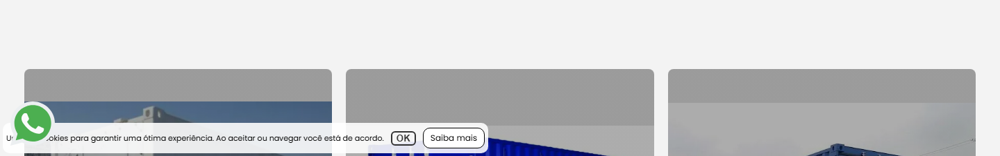

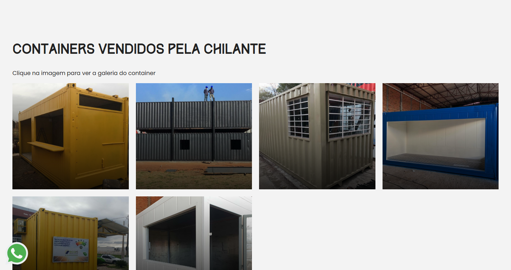

### Interaction States (screens/states/)

*Hover, focus, and active state captures*


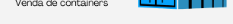


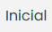


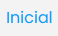


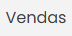

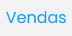

### Screenshot Index (screens/INDEX.md)

# Screenshot Index

## Scroll Journey

> Shows the cinematic state at each point of the page

| Scroll | Y Position | File |
|--------|-----------|------|
| 0% | 0px | `screens/scroll/scroll-000.png` |
| 17% | 603px | `screens/scroll/scroll-017.png` |
| 33% | 1171px | `screens/scroll/scroll-033.png` |
| 50% | 1774px | `screens/scroll/scroll-050.png` |
| 67% | 2376px | `screens/scroll/scroll-067.png` |
| 83% | 2944px | `screens/scroll/scroll-083.png` |
| 100% | 3547px | `screens/scroll/scroll-100.png` |

## Pages

| Page | URL | File |
|------|-----|------|
| Chilante Venda e personalização de Containers | `https://www.vendaschilantecontainer.com.br/` | `screens/pages/home.png` |
| Chilante Venda e personalização de Containers | `https://www.vendaschilantecontainer.com.br/index` | `screens/pages/index.png` |
| Catálogo de Produtos de Chilante Containers | `https://www.vendaschilantecontainer.com.br/vendas/index` | `screens/pages/vendas-index.png` |
| Modificações | Chilante Containers | `https://www.vendaschilantecontainer.com.br/modificacoes` | `screens/pages/modificacoes.png` |
| Vendidos | Chilante Containers | `https://www.vendaschilantecontainer.com.br/vendidos` | `screens/pages/vendidos.png` |

## Sections

| Page | Section | File |
|------|---------|------|
| home | #1 (section) | `screens/sections/home-section-1.png` |
| index | #1 (section) | `screens/sections/index-section-1.png` |
| vendas-index | #1 (section) | `screens/sections/vendas-index-section-1.png` |
| vendas-index | #2 (section) | `screens/sections/vendas-index-section-2.png` |
| modificacoes | #1 (section) | `screens/sections/modificacoes-section-1.png` |
| vendidos | #1 (section) | `screens/sections/vendidos-section-1.png` |

## Homepage Screenshots (screenshots/)


