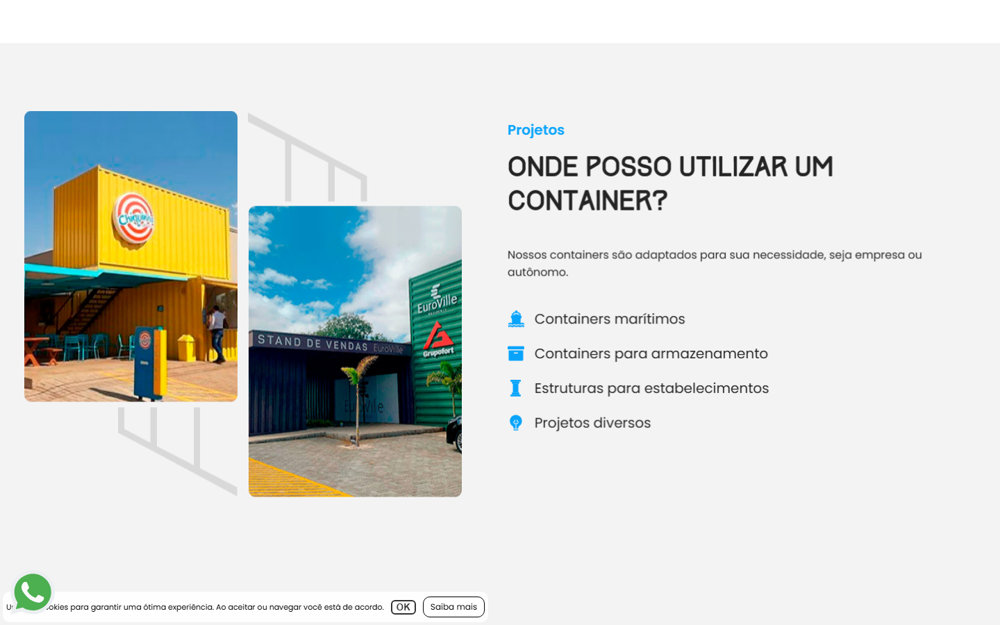
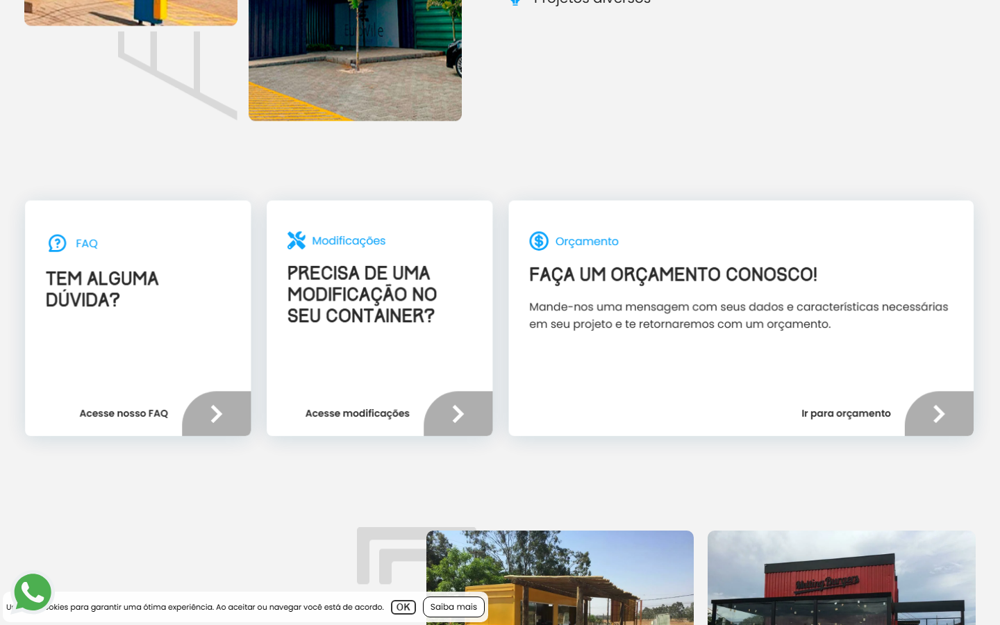
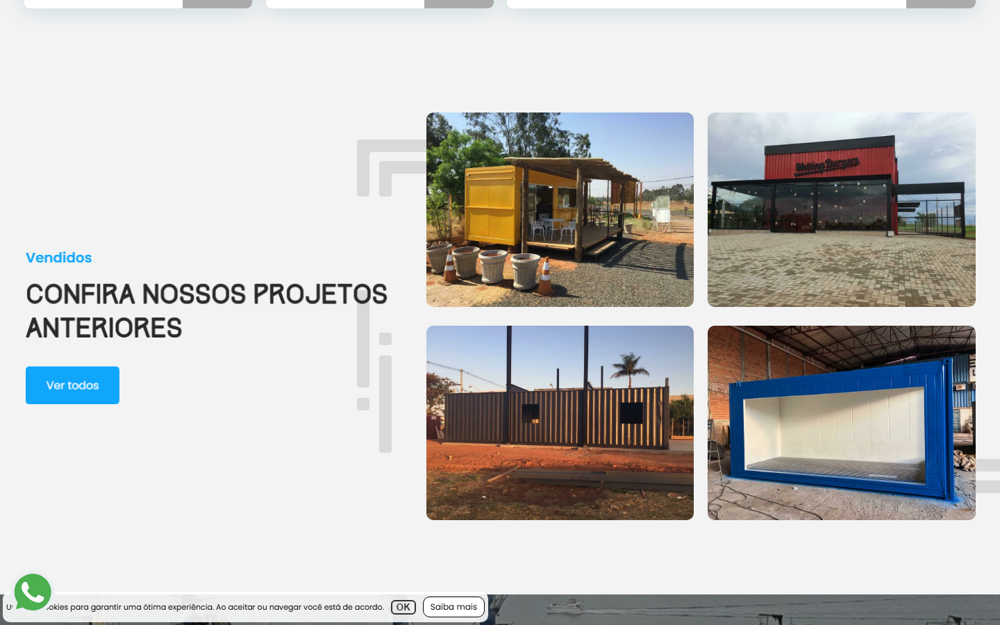
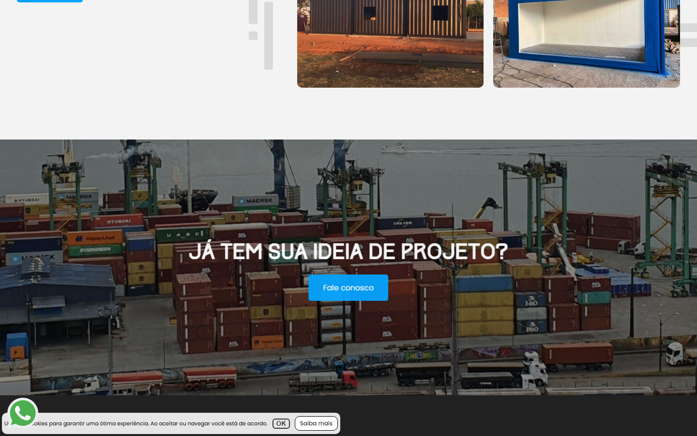
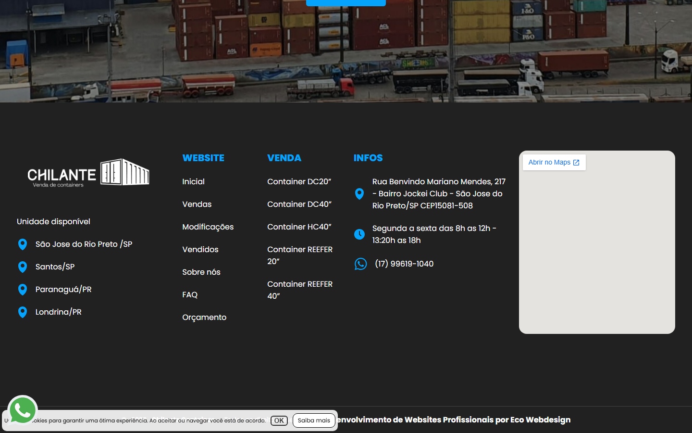

# Animation Reference

> Cinematic motion design extracted from live DOM. Follow these specs exactly to recreate the experience.

## Motion Technology Stack

| Library | Type | Notes |
|---------|------|-------|
| **GSAP v3.11.0** | animation |  |
| **ScrollTrigger** | scroll |  |
| **AOS (Animate On Scroll)** | scroll |  |
| **Web Animations API (2 active)** | animation |  |

## Scroll Journey

The page is **4.447px** tall. Each frame below shows what the user sees at that scroll depth.

> **Use these screenshots to understand WHAT animates, WHEN it animates, and HOW it moves.**

### 0% — Top / Hero
Scroll position: 0px


### 17% — Opening Section
Scroll position: 603px


### 33% — First Feature Section
Scroll position: 1.171px



### 50% — Mid-Page
Scroll position: 1.774px



### 67% — Lower Content
Scroll position: 2.376px



### 83% — Near Footer
Scroll position: 2.944px



### 100% — Bottom / Footer
Scroll position: 3.547px



## Scroll Animation Patterns

| Pattern | Library | Element Count | Duration | Delay | Easing |
|---------|---------|---------------|----------|-------|--------|
| parallax / sticky scroll | CSS | 5 | — | — | — |

### CSS Implementation

## CSS Keyframes (5 extracted)

### `@keyframes pumpInWhatsappButton`

Duration: `0.5s` · Easing: `ease-out` · Delay: `0s` · Iteration: `1` · Fill: `forwards`

Used by: `#whatsapp-button-page`

```css
@keyframes pumpInWhatsappButton {
  0% {
    opacity: 1;
    transform: scale(1);
  }
  30% {
    opacity: 1;
    transform: scale(1.2);
  }
  80% {
    transform: scale(0.9);
  }
  100% {
    opacity: 1;
    transform: scale(1);
  }
}
```

> Fade + motion enter animation

### `@keyframes shake-whatsappbutton`

Duration: `1s` · Easing: `cubic-bezier(0.36, 0.07, 0.19, 0.97)` · Delay: `0s` · Iteration: `1` · Fill: `both`

Used by: `#whatsapp-button-page:hover`

```css
@keyframes shake-whatsappbutton {
  10%, 90% {
    transform: translate3d(-1px, 0px, 0px);
  }
  20%, 80% {
    transform: translate3d(2px, 0px, 0px);
  }
  30%, 50%, 70% {
    transform: translate3d(-3px, 0px, 0px);
  }
  40%, 60% {
    transform: translate3d(2px, 0px, 0px);
  }
}
```

> Transform/motion animation

### `@keyframes slideInFromBottom`

Duration: `0.5s` · Easing: `cubic-bezier(0.25, 0.46, 0.45, 0.94)` · Delay: `0s` · Iteration: `1` · Fill: `both`

Used by: `#whatsapp-number-form`

```css
@keyframes slideInFromBottom {
  0% {
    transform: translateY(1000px);
    opacity: 0;
  }
  50% {
    transform: translateY(-30px);
    opacity: 1;
  }
  100% {
    transform: translateY(0px);
    opacity: 1;
  }
}
```

> Fade + motion enter animation

### `@keyframes slide-in-bottom`

Duration: `0.5s` · Easing: `cubic-bezier(0.25, 0.46, 0.45, 0.94)` · Delay: `0s` · Iteration: `1` · Fill: `both`

Used by: `.slide-in-bottom-eco-cookie`

```css
@keyframes slide-in-bottom {
  0% {
    transform: translateY(1000px);
    opacity: 0;
  }
  100% {
    transform: translateY(0px);
    opacity: 1;
  }
}
```

> Fade + motion enter animation

### `@keyframes slide-in-bottom`

Duration: `0.5s` · Easing: `cubic-bezier(0.25, 0.46, 0.45, 0.94)` · Delay: `0s` · Iteration: `1` · Fill: `both`

Used by: `.slide-in-bottom-eco-cookie`

```css
@keyframes slide-in-bottom {
  0% {
    transform: translateY(1000px);
    opacity: 0;
  }
  100% {
    transform: translateY(0px);
    opacity: 1;
  }
}
```

> Fade + motion enter animation

## Global Transition Declarations

These `transition` values were extracted from CSS rules across the site:

```css
transition: 0.3s;
transition: 1s;
transition: 1s cubic-bezier(0, 0, 0.07, 0.98);
transition: 0.5s;
transition: max-height 1s, opacity 0.5s;
transition: 0.5s ease-in-out;
transition: 0.5s cubic-bezier(0.99, 0.3, 0.15, 0.74);
transition: 0.6s ease-in-out;
transition: background 0.2s ease-out;
transition: 0.2s ease-out;
transition: opacity 0.2s ease-out;
```

## How to Recreate This Motion Design

### Step 1 — Install Dependencies

```bash
npm install gsap
npm install gsap
npm install aos
```

### Step 2 — Scroll-Reveal Pattern

Elements that animate into view follow this pattern:

```css
/* Initial hidden state */
.reveal {
  opacity: 0;
  transform: translateY(40px);
  transition: opacity 0.3s cubic-bezier(0.4, 0, 0.2, 1),
              transform 0.3s cubic-bezier(0.4, 0, 0.2, 1);
}
.reveal.visible {
  opacity: 1;
  transform: translateY(0);
}
```

### Step 3 — Key Motion Principles

- **GSAP ScrollTrigger** — scroll-linked animations (product rotation, parallax) use `ScrollTrigger.scrub` for frame-perfect scroll sync
- **Duration scale:** `0.3s` · `1s` · `0.5s` — use these values, never invent new durations
- **Always add** `@media (prefers-reduced-motion: reduce) { * { animation-duration: 0.01ms !important; transition-duration: 0.01ms !important; } }`

### Step 4 — Scroll Journey Reference

Match what happens at each scroll position:

- **0%** (`0px`) → `screens/scroll/scroll-000.png`
- **17%** (`603px`) → `screens/scroll/scroll-017.png`
- **33%** (`1171px`) → `screens/scroll/scroll-033.png`
- **50%** (`1774px`) → `screens/scroll/scroll-050.png`
- **67%** (`2376px`) → `screens/scroll/scroll-067.png`
- **83%** (`2944px`) → `screens/scroll/scroll-083.png`
- **100%** (`3547px`) → `screens/scroll/scroll-100.png`

